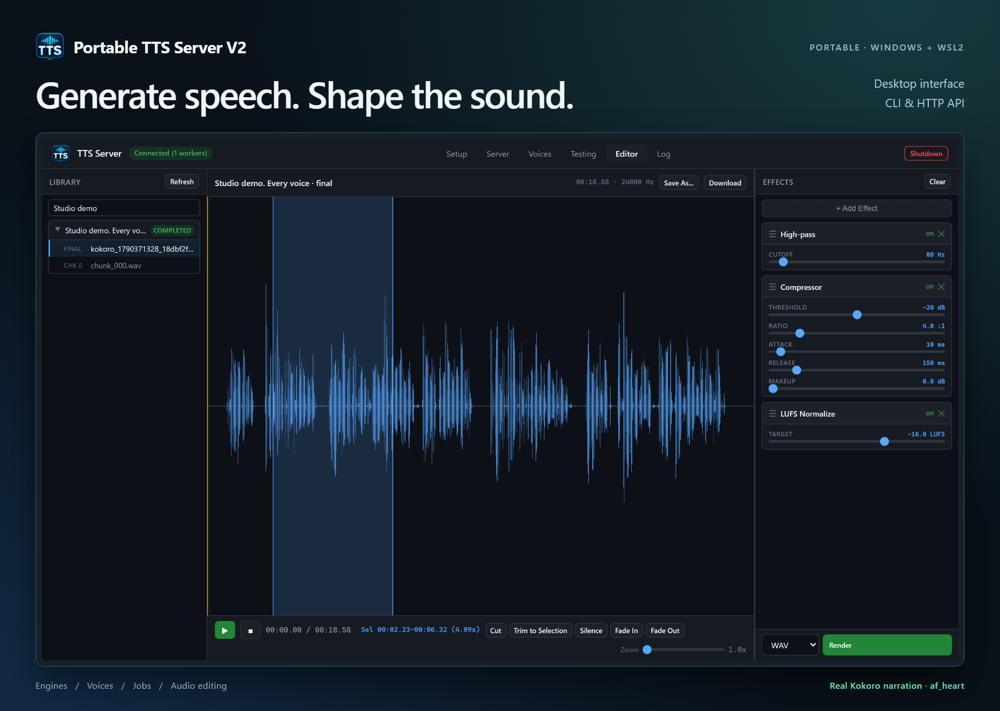

# Portable TTS Server V2



**A portable speech studio for Windows, powered by its own WSL2 Linux distro.** Generate speech, manage engines and voices, create subtitles, and edit audio in a desktop window. The same features are available through a Windows CLI and authenticated HTTP API.

[Illustrated quickstart](manual/quickstart.md) · [User manual](manual/README.md) · [Portable releases](https://github.com/aivrar/portable-tts-server-V2/releases)

## Download and run

1. Enable current **WSL2** on Windows 10/11 x64. Run `wsl --status` to check it. If needed, install WSL with `wsl --install --no-distribution` in an administrator terminal and restart when requested. Existing older installations may need `wsl --update` for in-place VHD registration.
2. Download **all ZIP parts**, `portable-manifest.json`, and both `Extract-Portable-TTS` files from the release into one folder. Double-click `Extract-Portable-TTS.cmd`. It verifies SHA256 checksums, joins the parts, and extracts the app.
3. Put the extracted **Portable-TTS-Server-V2** folder on a local drive with enough free space. Spaces in the path are supported. Network shares are not.
4. Double-click **Start-TTSServer.cmd**. First launch imports the included Linux image into `wsl/ext4.vhdx`; later starts reuse that disk.
5. In **Server**, select **Kokoro 82M**, choose CPU or an available GPU, and spawn a worker. In **Testing**, choose a built-in voice, enter text, and generate.

Alternatively, download the two extraction helpers and run `Extract-Portable-TTS.cmd -Download` to fetch the manifest and missing parts automatically before verifying/extracting them. The launcher is currently unsigned, so Windows may display an unknown-publisher prompt.

**Kokoro is included and ready offline.** Its weights, English pronunciation model, Japanese dictionary, and Chinese pronunciation dependencies are bundled. Other engines install from Setup into this portable copy when chosen. Those installations need internet access; gated models require your Hugging Face access. Edge always needs internet. Whisper transcription/subtitle weights are optional downloads.

The release includes Windows Python for `tts.cmd`, a self-contained native launcher, WebView2 Fixed Version, Linux Python, PyTorch/CUDA user-space libraries, FFmpeg, audio tools, and Kokoro. No separate Python, .NET, browser runtime, or CUDA toolkit installation is needed. **Windows, WSL2, virtualization support, and an optional NVIDIA GPU driver are host requirements.** CPU Kokoro works without an NVIDIA GPU.

## Keep it portable

Run **Stop-TTSServer.cmd** before moving, copying, or backing up the app. Once it confirms the disk is released, copy the **entire folder**, including `wsl/ext4.vhdx`, voices, projects, and settings. If WSL keeps the disk locked, use `.\Copy-TTSServer.ps1 -Destination 'D:\Portable-TTS-Server-V2'` to transfer this copy without stopping other WSL apps. Start at the new local path; the wrapper imports or registers that folder's disk and refreshes paths.

WSL keeps a registration in the current Windows account. Moving the stopped folder may leave an unused registration for the previous path. The launcher never unregisters another distro or overwrites another copy. See [portability](PORTABILITY.md) for details and space requirements.

## Source and building

The repository contains application source, the native launcher's C# project, icons, tests, and the illustrated manual. Large runtimes and personal data are excluded from Git. **GitHub's automatic “Source code” ZIP is not the runnable portable release.**

Maintainers build from a clean Ubuntu image using [the build instructions](release/BUILD.md). The public image is built separately from the private development distro. Runtime downloads and Kokoro weights are pinned in [runtime-sources.json](release/runtime-sources.json); inventories and third-party notices accompany the release.

## Checks

Backend tests run inside a configured TTS distro using its Linux dependencies:

```bash
PYTHONPATH=server:. /opt/tts_server/venv/bin/python3 -m pytest server -q
```

Install pytest into a separate test dependency directory if unavailable. Browser logic tests run from the repository root:

```powershell
node --test server/test_browser_regressions.cjs
```

The portable build also performs real CPU synthesis with network connections blocked for all nine Kokoro language groups. See [the repair ledger](CODE_AUDIT_FINDINGS.md) and [repository audit](REPO_AUDIT.md) for test evidence and limitations.

## Documentation and license

- [CLI](CLI.md) and [HTTP API](API_REFERENCE.md)
- [Architecture](app_intents.md) and [storage](manual/storage-layout-and-ports.md)
- [MIT license](LICENSE) for this application; [third-party notices](THIRD_PARTY_NOTICES.md) for bundled components

The older `aivrar/portable-tts-server` repository remains separate from this V2 Windows/WSL package.
