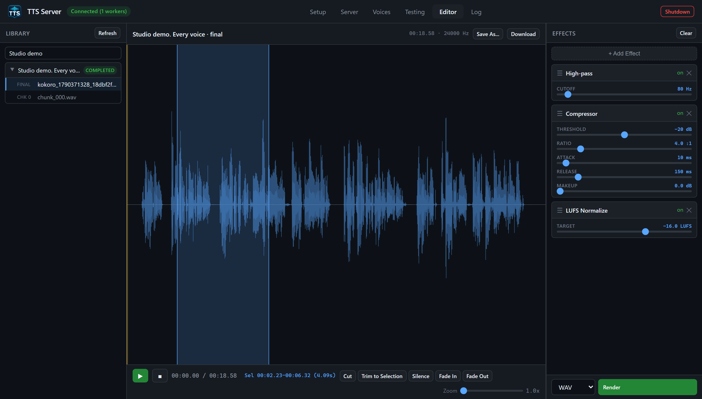
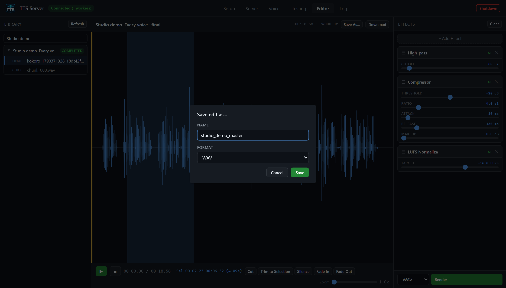
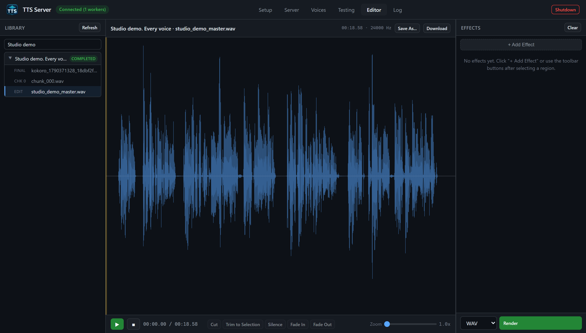

# Editor tab

The nav label is **Editor**. Internally it is the jobs tab (`data-tab="jobs"`, `tab-jobs.js`). It is a three-pane **single-track audio editor** over files the job system already produced. Renders are non-destructive: they write a new file under `<job_dir>/edits/` and leave the original FINAL / chunk intact.

## Layout



*The blue area marks a selection. The three displayed effects are full-track effects; a selection only limits an operation added with a range button.*

```text
[ Library | Editor (waveform + transport) | Effects rack ]
```

The canvas is zero-sized while the tab is hidden; switching to Editor re-measures on the next frame. If the waveform looks empty after a generate, click Editor once and wait a tick, or click **Refresh**.

## Library (left)

Header **Library** plus **Refresh** (`GET /api/jobs` via `App.pollJobs()`).

Search box: `Search jobs / text...` filters on `text_preview`, `model`, and `job_id`.

Empty: `No jobs yet — generate something on the Testing tab.` or `No matches.`

Each job is a foldable row:

- Caret, a title (first 60 characters of the preview, or `model · first-8-of-uuid`), and a status badge (`completed` / `running` / `partial` / `failed`).
- Click the header to expand. Right-click for a job context menu.

When expanded:

- **FINAL** — the assembled file (`kind: final`, `job_id`) if `final_file` is set.
- **CHK N** — each completed chunk WAV (`chunk_000.wav`, …). Pending chunks show `N chunk(s) not yet generated`.
- **EDIT** — previous renders from `GET /api/audio/edits/{job_id}`. Each edit has a **✕** to delete (`DELETE /api/audio/edits/{job_id}/{filename}`).

Click a FINAL / CHK / EDIT row to load it as the source. The active row is highlighted.

## Center: waveform and transport

Top toolbar:

| Control | Role |
| --- | --- |
| Source name | e.g. job preview · final |
| Source meta | duration / format |
| **Save As...** | Choose an edit name and format; saves under the job's `edits/` directory |
| **Download** | Fetches the current source audio through the authenticated blob helper |

The canvas shows min/max peaks from `POST /api/audio/peaks` (`buckets` default 1024). Overlay: selection rectangle and playhead. Empty text: `Pick a track from the library to start editing`. Loading text: `Loading...`.

Transport:

| Control | Role |
| --- | --- |
| **▶** | Play / pause the current source (not a live preview of unrendered effects) |
| **■** | Stop, playhead back |
| Time | `00:00.00 / 00:00.00` |
| Selection time | start–end when a range is selected |
| **Cut** | Range op `cut` |
| **Trim to Selection** | Range op `trim` |
| **Silence** | Range op `silence` |
| **Fade In** | Range op `fade_in` |
| **Fade Out** | Range op `fade_out` |
| **Zoom** | 1.0× to 40× |

Range buttons stay disabled until you drag a selection on the waveform. Range ops are **queued in the effects chain** (they run before full-track effects on Render). Rendering writes a new edit; the source file is preserved.

Click-drag on the canvas sets `start_sec` / `end_sec`. Zoom slider changes `_zoom`; you can pan via view offset when zoomed in.

## Effects rack (right)

Header **Effects** plus **Clear** (empties the chain).

**+ Add Effect** opens a menu grouped by category (from `FX_DEFS` in `tab-jobs.js`):

| Category | Effect label | Type id | Parameters (GUI min/max/default) |
| --- | --- | --- | --- |
| Volume | Gain | `gain` | Gain -24..24 dB, default 0 |
| Time / Pitch | Speed (Tempo) | `tempo` | Factor 0.5..2.0×, default 1.0 (rubberband) |
| Time / Pitch | Pitch Shift | `pitch` | Semitones -12..12, default 0 |
| EQ | High-pass | `eq_highpass` | Cutoff 20–1000 Hz, default 80 |
| EQ | Low-pass | `eq_lowpass` | Cutoff 1000–20000 Hz, default 12000 |
| EQ | Bass Shelf | `eq_shelf_low` | Frequency 50–500 Hz default 200; Gain -12..12 dB |
| EQ | Treble Shelf | `eq_shelf_high` | Frequency 1000–12000 Hz default 4000; Gain -12..12 dB |
| Space | Reverb | `reverb` | Room 0–1 default 0.5; Damping 0–1 default 0.5; Wet 0–1 default 0.3 |
| Space | Echo / Delay | `echo` | Delay 0.05–1 s default 0.25; Feedback 0–0.95 default 0.4; Wet 0–1 default 0.4 |
| Dynamics | Compressor | `compressor` | Threshold -40..0 dB default -20; Ratio 1–20 default 4; Attack 1–200 ms default 10; Release 10–1000 ms default 150; Makeup 0–24 dB |
| Dynamics | Noise Gate | `noise_gate` | Threshold -80..-20 dB default -50; Attack 1–50 ms default 5; Release 10–500 ms default 100 |
| Restoration | De-reverb | `de_reverb` | Strength 0–1 default 0.5 |
| Restoration | De-esser | `de_ess` | Strength 0–1 default 0.5 |
| Mastering | LUFS Normalize | `normalize_lufs` | Target -36..-6 LUFS default -16 |
| Mastering | Peak Normalize | `normalize_peak` | Target 0.5–1 default 0.95 |

Each chain item can be enabled/disabled and has its sliders. Order is the render order after range ops.

Footer: format select **wav / flac / ogg / mp3** and primary **Render**.

**Render** calls `POST /api/audio/render` with:

```json
{
  "source": {"kind": "final", "job_id": "..."},
  "edits": [{"type": "gain", "params": {"db": 3}}],
  "output_format": "wav",
  "overwrite": false
}
```

Job-bound sources default to an auto-versioned name under `<job_dir>/edits/` when you do not Save As. A `path` source (CLI/API only from outside the job library) **requires** `output_path` under `voices`, `output`, or `projects_output`.

A missing effect dependency or an invalid edit makes Render fail with an explicit error. Install the dependency and retry; the server does not publish a file with silently skipped effects. A chain that removes all audio is rejected. Stereo sources retain their channels.

After Render, the new EDIT appears in the library. You can load it and stack another chain. Changes made to the chain or source while rendering are preserved. Range selections stay anchored to the waveform through earlier cuts, trims, padding, and tempo changes.

## Save As and Download

**Save As...** opens a dialog with **Name** and **Format**. Enter a simple filename such as `studio_demo_master` and choose WAV, FLAC, OGG, or MP3, then click **Save**. This renders the current effects into a named file under the job's `edits/` directory. You can omit the extension. Absolute output paths are available through the CLI/API, not this dialog; API `output_name` and `output_path` are mutually exclusive.

**Download** pulls the current audio through the token header so you can save a copy on the Windows side without browsing `\\wsl$`.



*Save As renders the queued effects into a named edit. Play and Download use the currently loaded source, so render first to hear or download your changes.*



*After a successful save, the EDIT is loaded and the applied effects chain clears. The original FINAL and CHK rows remain available.*

## What the Editor tab is not

It is not a multi-track DAW. It is not where you change TTS text (use `tts.cmd jobs edit-chunk` / `PUT /api/jobs/{id}/chunks/{idx}` and rerun). It does not generate SRT (see the SRT page). It lists jobs but does not delete them (use `tts.cmd jobs delete` or `POST /api/jobs/delete`; running jobs are refused).

## Related pages

- [Audio editor usage](audio-editor-usage.md) (full effect contract + CLI)
- [Jobs and projects](jobs-and-projects.md)
- [Testing tab](gui-testing.md)
