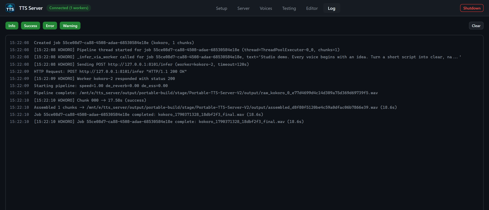

# Log tab and Shutdown



*The displayed log was cleared before the demo to exclude unrelated activity. Clear only removes the visible log history.*

## Log tab

The **Log** tab is a live viewer over the SSE stream `GET /api/logs/stream`. `app.js` keeps a ring buffer of **500** entries (`MAX_LOGS`). The token is passed as `?token=` because `EventSource` cannot send `X-TTS-API-Token`. Do not copy that EventSource URL into a browser bookmark; it contains the secret.

### Toolbar

Four filter toggles, all on by default (primary styling when enabled):

- **Info**
- **Success**
- **Error**
- **Warning**

Click a toggle to hide that level. The list re-renders from the in-memory buffer.

**Clear** wipes `App.state.logs` and the DOM. It does **not** truncate `E:\tts_server\output\logs\` or `output\run\tts_server_setup.log`. Persistent tails are CLI/API:

```cmd
tts.cmd logs tail --file server --lines 200
tts.cmd logs tail --file bridge --lines 200
tts.cmd logs tail --file setup --lines 500
tts.cmd logs tail --file startup --lines 200
tts.cmd logs follow --filter "XTTS" --reconnect
```

`file` must be one of `server`, `bridge`, `setup`, `startup`. `logs follow` is the SSE stream with an optional regex filter.

### Log body

Each line is timestamp + message, colored by level (`log-info`, `log-success`, `log-error`, `log-warning`). Auto-scroll stays on while you are within 40px of the bottom; scrolling up freezes the pin so you can read. New lines while pinned-to-bottom keep following.

Malformed SSE frames are dropped with a `console.debug` on the WebView side; they are not silently the only copy of a failure — check `logs tail` if the GUI missed a line.

### When to watch this tab

- After **Install** / **Install All** (Setup switches you here on purpose).
- During a long **Spawn Worker** (qwen/higgs/voxtral cold loads).
- When Generate fails with a short toast; the worker traceback is here or in `output\logs\`.

## Shutdown button

Red header control, tooltip: `Stop all workers, unload models, and close the app`.

Click path (from `App.initShutdownButton`):

1. Button disabled, label **Shutting down...**.
2. Worker poll interval cleared (dying server should not toast disconnect spam).
3. SSE log stream closed.
4. `POST /api/shutdown` with the API token.
5. Native `window.closeApp()` if the launcher injected it; otherwise `window.close()`.
6. If step 4 fails: console error, toast `Shutdown failed: ...`, button restored to **Shutdown**, and connection polling resumed.

Gateway behavior for `/api/shutdown`:

- Unload all workers (full process groups).
- Unpublish discovery (registry file removed).
- Tell the bridge to **suppress backend restart** and exit.
- Acknowledge the UI.
- Write the shutdown marker and exit the gateway.
- The native host closes its own window; it does not kill other launcher instances.

This is the supported way to stop the linux distro for windows users session without `wsl --shutdown` (which would also kill other Linbox distros).

### After Shutdown

- `tts.cmd health` should fail with exit code **2** (server unreachable).
- `E:\tts_server\output\run\registry\tts_server.json` should be gone.
- GPU VRAM used by this app should release (confirm with `nvidia-smi` inside this copy's distro (get its name with `Start-TTSServer.ps1 -VerifyOnly`) only if you still have a reason to enter the distro; a clean Shutdown already killed workers).
- The VHDX stays registered. Next double-click of `Start-TTSServer.cmd` is a warm start, not a re-import.

Do not use Shutdown to unload a single engine. Use Server tab **Kill** or `tts.cmd model unload <id>`.

## Related pages

- [Start, stop, and portability](start-stop-and-portability.md)
- [Setup tab](gui-setup.md) (install logs)
- [Server tab](gui-server.md)
- [Troubleshooting](troubleshooting.md)
