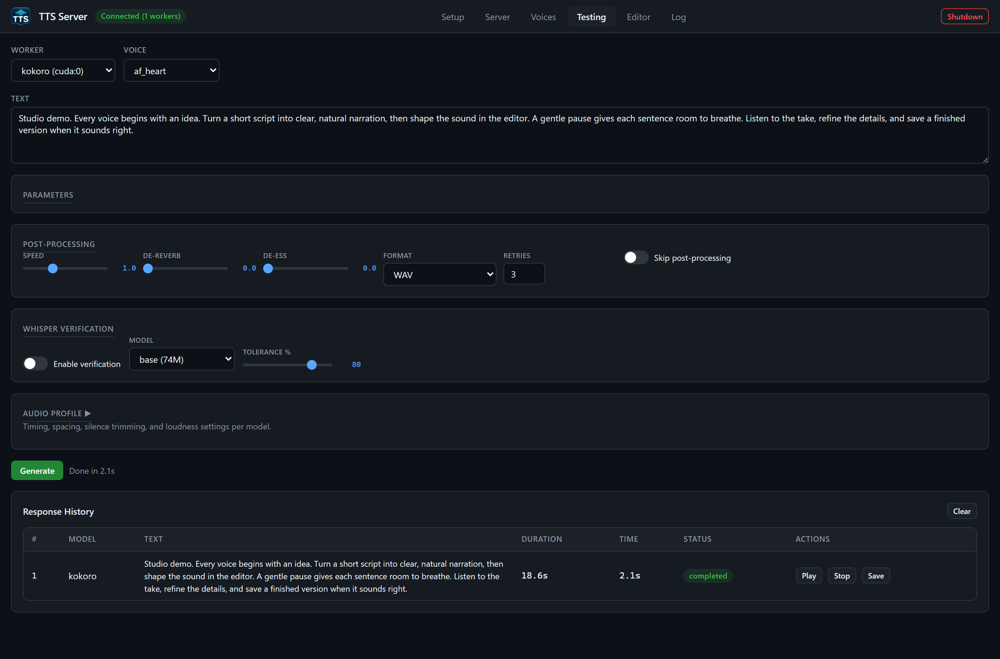

# Testing tab

The **Testing** tab is the interactive speak-this-text surface. It sends `POST /api/tts/{model}` (JSON) or `POST /api/tts/{model}/upload` (multipart when you attach a fresh reference file). It does **not** submit async jobs via `/submit`; it blocks until the pipeline returns, then shows a **Response History** row you can Play / Stop / Save.

You must have a **ready or busy worker** already spawned on the Server tab. If the Worker dropdown says `-- No workers loaded --`, Generate toasts `Select a worker first`.

## Layout, top to bottom

*An actual 18.6-second demo take. Generation time varies with the engine, hardware, and whether it is the first request.*

1. **Worker** and **Voice** dropdowns
2. **Saved Voice** / **Or Upload** / **Reference Text** row (hidden unless the engine declares `ref_audio`)
3. **Text** textarea (default sample: `Hello, this is a test of the text to speech system.`)
4. **Insert style tag...** row (hidden unless the engine declares `style_tags`)
5. **Parameters** panel (engine-native sliders and extra fields)
6. **Post-Processing** panel
7. **Whisper Verification** panel
8. Collapsible **Audio Profile** panel
9. **Generate** button and `gen-status` line
10. **Response History** table

## Worker

Filled from workers with status `ready` or `busy`. Labels look like `kokoro (cuda:0)` or `xtts (cuda:0, busy)`. Changing Worker rebuilds Voice, Parameters, style tags, and the reference row for that engine. A transient disconnect does not wipe your sliders.

The selected worker's `device` is sent on the request so the gateway pins that GPU.

## Voice

Populated from `GET /api/tts/{model}/voices`. Built-in catalogs (Kokoro `.pt` stems, XTTS named speakers, Bark `v2/en_speaker_6`, Edge live names, Orpheus `tara`, …) appear here. `-- None --` means the engine has no built-in list (you clone from Saved Voice instead).

For XTTS, picking a named speaker such as `Daisy Studious` uses that built-in; cloning uses Saved Voice / Upload (API `mode` defaults to `cloned` when a reference path is supplied). See the engines catalog.

## Saved Voice / Or Upload / Reference Text

Visible when `MODEL_SETUP[model].ref_audio` is true.

| Control | Behavior |
| --- | --- |
| **Saved Voice** | Files from `GET /api/voices`. First option `-- None (upload or manage in Voices tab) --`. Choosing one clears the file picker. The filename is sent as `voice`. |
| **Or Upload** | `<input type="file" accept="audio/*">`. Choosing a file clears Saved Voice. Generate then uses multipart `/upload` with field `reference_audio`. |
| **Reference Text** | Shown only when `ref_text` is true (f5, fish, higgs, outetts, voxcpm2, csm). Sent as `reference_text`. Use the exact transcript of the clip. |

**VibeVoice and F5** require reference audio: Generate shows an error if the required reference is missing. For F5, select a Saved Voice or upload a reference file; also supply its exact transcript.
For VibeVoice, choose Saved Voice for Speaker 1 and the optional saved voices for Speakers 2–4 in order, without gaps. A fresh upload supplies a single speaker reference. The JSON API also accepts `reference_audios`; see [Authenticated HTTP API](http-api.md).

## Text

Required. Empty Generate toasts `Enter text to synthesize`. Long text is chunked server-side using per-engine `TEXT_LIMITS` (for example bark 200 characters, edge 3000). You do not pick chunk size in the GUI.

## Style tags

Visible when `style_tags` is true. Dropdown **Insert style tag...** plus **Insert**. Hint: `Add emotion/style cues — model interprets these from the text`.

Engines with a **model-specific** dialect (do not use the generic list or the engine may speak the cue literally):

| Engine | Inserted tokens |
| --- | --- |
| **bark** | `[laughs] `, `[sighs] `, `[gasps] `, `[clears throat] `, `[music] ` |
| **dia** | `(laughs) `, `(sighs) `, `(clears throat) `, `(coughs) `, `(gasps) ` |
| **fish** | `(excited) `, `(sad) `, `(angry) `, `(whispering) `, `(shouting) `, `(laughing) `, `(sighing) ` |
| **voxcpm2** | Leading voice-design, e.g. `(young woman, warm and calm) `. Insert **replaces** an existing leading `(...)` rather than injecting mid-sentence. |
| **orpheus** | `<laugh> `, `<sigh> `, `<chuckle> `, `<cough> `, `<sniffle> `, `<groan> `, `<yawn> `, `<gasp> ` |

Other style-tag engines fall back to the generic list: `(happily) `, `(sadly) `, `(angrily) `, `(with surprise) `, `(sarcastically) `, `(nervously) `, `(whispering) `, `(shouting) `, `(laughing) `, `(sighs) `, `... `, `(cheerfully) `, `(calmly) `, `(in a serious tone) `, `(speaking slowly) `, `(speaking quickly) `.

Dia dialogue additionally uses `[S1]` / `[S2]` in the text itself (example: `[S1] Hello there! (laughs) [S2] Hey, how are you?`). VibeVoice uses `Speaker 1:` / `Speaker 2:` lines. Those are typed in **Text**, not in this dropdown.

## Parameters panel

Sliders come from `GET /api/config` → `defaults` for that model plus `params` (label, min, max, step, format). Per-model `param_overrides` narrow ranges (Fish Speech temperature max **1.0**). Extra **fields**:

| Engine | Field | UI |
| --- | --- | --- |
| xtts | **Language** | Select: English, Spanish, French, German, Italian, Portuguese, Polish, Turkish, Russian, Dutch, Czech, Arabic, Chinese, Japanese, Korean, Hungarian, Hindi (`en` … `hi`) |
| parler | **Voice Description** | Text, hint `Describe speaker, recording quality, pace, tone...` |
| higgs | **Scene / Speaker Description** | Text, hint `e.g. SPEAKER0: warm mature voice; moderate pace; quiet studio` |

Default slider values (from `MODEL_DEFAULTS`):

| Engine | Defaults shown |
| --- | --- |
| xtts | temperature 0.65, repetition_penalty 2.0, top_k 50, top_p 0.85 |
| fish | temperature 0.8, repetition_penalty 1.1, top_p 0.8, seed 0 |
| kokoro | (none) |
| bark | temperature 0.7, waveform_temperature 0.7 |
| chatterbox | temperature 0.8, repetition_penalty 1.2, exaggeration 0.5, cfg_weight 0.5 |
| f5 | nfe_step 32, cfg_scale 2.0, seed 0 |
| dia | temperature 1.8, cfg_scale 3.0, top_p 0.90, top_k 50 |
| qwen | temperature 0.9, top_p 0.8, top_k 40, seed 0 |
| vibevoice | cfg_scale 1.3, seed 0 |
| higgs | temperature 0.3, top_p 0.95, top_k 50, seed 0 |
| speecht5 | (none) |
| parler | temperature 1.0 |
| outetts | temperature 0.4, repetition_penalty 1.1, top_p 0.9, top_k 40, seed 0 |
| vits | (none) |
| edge | pitch 0, volume 0 |
| voxtral | cfg_alpha 1.2, seed 42 |
| voxcpm2 | cfg_scale 2.0, nfe_step 10 |
| csm | temperature 0.9, top_p 0.95, top_k 50, seed 42 |
| orpheus | temperature 0.6, top_p 0.95, repetition_penalty 1.1, seed 42 |

Hover tooltips match `TOOLTIPS` in config (temperature = randomness, exaggeration = Chatterbox emotion, nfe_step = diffusion steps, pitch/volume = Edge Hz / percent, cfg_alpha = Voxtral guidance, …).

Global slider bounds (before per-model overrides):

| Param | Label | Min | Max | Step |
| --- | --- | --- | --- | --- |
| temperature | Temperature | 0.0 | 3.0 | 0.05 |
| speed | Speed | 0.5 | 2.0 | 0.1 |
| repetition_penalty | Repetition Penalty | 0.5 | 5.0 | 0.1 |
| top_p | Top P | 0.0 | 1.0 | 0.05 |
| top_k | Top K | 1 | 200 | 1 |
| cfg_scale | CFG Scale | 0.0 | 10.0 | 0.5 |
| exaggeration | Exaggeration | 0.0 | 1.0 | 0.05 |
| cfg_weight | CFG Weight | 0.0 | 1.0 | 0.05 |
| waveform_temperature | Waveform Temperature | 0.0 | 3.0 | 0.05 |
| seed | Seed | 0 | 99999 | 1 |
| nfe_step | NFE Steps | 4 | 64 | 4 |
| pitch | Pitch Hz | -50 | 50 | 5 |
| volume | Volume % | -50 | 50 | 5 |
| cfg_alpha | CFG Alpha | 0.5 | 3.0 | 0.1 |
| de_reverb | De-reverb | 0.0 | 1.0 | 0.1 |
| de_ess | De-ess | 0.0 | 1.0 | 0.1 |
| tolerance | Tolerance | 0 | 100 | 5 |

Note: the HTTP API allows exaggeration 0–2 and nfe_step 4–128; the Testing sliders use the table above. Chatterbox's documented API range for exaggeration is 0–2 with default 0.5.

## Post-Processing panel

These are **app-level**, applied after the engine returns audio:

| Control | Default | Meaning |
| --- | --- | --- |
| **Speed** | 1.0 (0.5–2.0) | Pitch-preserving time-stretch via pyrubberband |
| **De-reverb** | 0.0 | Leave at 0 for clean speech; raise only if the take is actually reverberant |
| **De-ess** | 0.0 | Harsh-sibilance reduction |
| **Format** | WAV | WAV, MP3, OGG, FLAC (Testing does not offer m4a; the API does) |
| **Retries** | 3 (0–10) | `auto_retry` |
| **Skip post-processing** | off | `skip_post_process` |

## Whisper Verification panel

| Control | Default |
| --- | --- |
| **Enable verification** | off (`verify_whisper`) |
| **Model** | base (74M); also tiny (39M), small (244M), medium (769M), large (1.5B) |
| **Tolerance %** | 80 |

When enabled, the pipeline transcribes the take and compares to the source text. Failures can trigger retries. This loads Whisper (VRAM). Unload it when you are done (`tts.cmd model unload whisper`).

## Audio Profile panel

Collapsed by default (title `Audio Profile ▶`). Click to expand. Hint: `Timing, spacing, silence trimming, and loudness settings per model.` Sliders start at that engine's `PROFILES` values; **only values you change** are sent.

| Slider | Range | Typical default |
| --- | --- | --- |
| Inter-chunk Pause (s) | 0–2.0 | 0.15–0.3 depending on engine |
| Front Pad (s) | 0–1.0 | 0 (kokoro 0.15) |
| Start/End Pad (s) | 0–2.0 | 0.5 |
| Silence Threshold (dB) | -60 to -10 | -35 or -40 |
| Min Silence (ms) | 100–2000 | 300–500 |
| Front Protect (ms) | 0–500 | 80–250 |
| End Protect (ms) | 0–2000 | 600–1100 |
| Peak Limit | 0.5–1.0 | 0.95 (`clipping`) |
| Target LUFS | -40 to -10 | -23 |

Native sample rates (not sliders, but what you hear): most engines 24000 Hz; SpeechT5 16000; VITS 22050; Dia / Parler / OuteTTS 44100; VoxCPM2 48000.

## Generate

1. Validates worker + text (+ VibeVoice reference).
2. Disables the button; status shows a spinner **Generating...**.
3. Builds the JSON body (text, voice, params, fields, post-process, optional profile diffs, optional Whisper, device, and the selected worker ID).
4. If a file is attached: multipart `/api/tts/{model}/upload`. Else JSON `/api/tts/{model}`.
5. On success: history row with blob playback, toast `Generated Ns of audio`, status `Done in Ts`.
6. On failure: history row with the error under the text, toast `Generation failed: ...`, status `Failed`.
7. Button always re-enables.

Audio is also stored as a job under `output/jobs/` (and shows up in the Editor library). Sync responses may omit `audio_base64` if the file is larger than 25 MB; you can still fetch `GET /api/jobs/{job_id}/output`.

## Response History

Columns: **#**, **Model**, **Text** (full, wrapping; errors underneath in red), **Duration**, **Time** (wall seconds), **Status**, **Actions** (**Play**, **Stop**, **Save** when a blob exists).

**Clear** on the panel header wipes the in-memory list (it does not delete jobs on disk). Blob URLs are revoked on `pagehide`.

## Related pages

- [Server tab](gui-server.md)
- [Voices tab](gui-voices.md)
- [Engines catalog](engines-catalog.md)
- [Jobs and projects](jobs-and-projects.md)
- [SRT and Whisper](srt-and-whisper.md)
