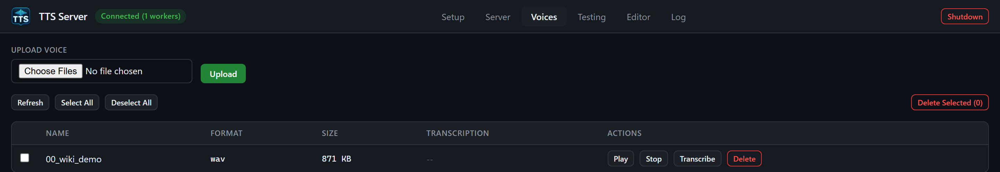

# Voices tab

The **Voices** tab manages **reference audio files** stored in `E:\tts_server\voices`. These are not Kokoro's built-in `af_heart` names and not Edge's `en-US-JennyNeural` catalog. They are WAV/MP3/FLAC/OGG clips you clone from, condition on, or transcribe.

You can also drop files into `E:\tts_server\voices` in Explorer and click **Refresh**.

## Layout



*Cropped after the demo row to keep unrelated voice files private. This synthetic clip illustrates file management; the Kokoro take used the built-in af_heart voice.*

1. **Upload Voice** row: file picker (`accept="audio/*"`, **multiple**) and primary **Upload**.
2. Toolbar: **Refresh**, **Select All**, **Deselect All**, **Delete Selected (N)**.
3. Table of voices.

## Upload

1. Click the file input, choose one or more audio files (server cap **50 MB** each).
2. Click **Upload**.
3. Each file is `POST /api/voices/upload` as multipart field `file` with the API token header.
4. Toasts report success or failure per file; the table refreshes.

CLI equivalent:

```cmd
tts.cmd voices upload C:\path\to\my-voice.wav
```

Keep clips **clean, dry, single-speaker**. Several engines document a sweet spot of **5–15 seconds**. Long LibriVox excerpts reduced Fish Speech intelligibility in the guarded probe. OuteTTS cloning wants a clip no longer than 15 seconds plus its exact transcript.

## Table columns

| Column | Content |
| --- | --- |
| Checkbox | Multi-select for bulk delete |
| **Name** | Display name (filename stem) |
| **Format** | wav / mp3 / flac / ogg |
| **Size** | B / KB / MB |
| **Transcription** | Cached sidecar text, or `--` if none |
| **Actions** | **Play**, **Stop**, **Transcribe**, **Delete** |

Empty state: `No voice files found. Upload .wav/.mp3/.flac/.ogg files above, or drop them into the voices/ directory.`

## Play and Stop

**Play** fetches `GET /api/voices/{filename}/audio` with the token header, builds a blob URL, and plays it. The token never appears in the audio element's `src`. **Stop** calls `App.stopAudio()`.

## Transcribe

**Transcribe** runs Whisper on that file: `POST /api/voices/{filename}/transcribe`. Query defaults match the API: `size=base`, `word_timestamps=false`, optional `language`, `task=transcribe` (or `translate`). The GUI uses the defaults. The plain transcript is cached as `<filename>.txt` beside the audio (for `bill_boerst_male.wav` that is `bill_boerst_male.wav.txt`). The table then shows that text. Replacing the audio clears its transcript. Uploads are validated and published atomically; a transcription racing with replacement is rejected for retry. Legacy stem-only transcripts are read only when the audio filename is unambiguous.

You need Whisper installed (Setup card) and enough VRAM/CPU for the chosen size. The API will spawn a Whisper worker if needed.

CLI:

```cmd
tts.cmd voices transcribe bill_boerst_male.wav --size base
tts.cmd voices info bill_boerst_male.wav
```

`info` prints size, sample rate, channels, frames, duration, format, transcription.

## Delete

Row **Delete** removes that file and its `.txt` sidecar (`DELETE /api/voices/{filename}`).

**Delete Selected (N)** bulk-deletes checked rows (`POST /api/voices/delete` with `{filenames: [...]}`).

**Select All** / **Deselect All** toggle checkboxes. The selected set is pruned when a file disappears after Refresh.

CLI:

```cmd
tts.cmd voices delete bill_boerst_male.wav
tts.cmd voices rename old.wav new.wav
tts.cmd voices download bill_boerst_male.wav --out C:\out\me.wav
tts.cmd voices list
```

Rename is **not** on the GUI; use CLI or `POST /api/voices/{filename}/rename` with `{new_name}` (1–128 characters). The sidecar is renamed with the audio.

## Using a saved voice on the Testing tab

On **Testing**, engines with `ref_audio: true` show **Saved Voice** and **Or Upload**. Saved Voice is this same library. Picking a saved voice fills `voice` with the filename. Engines that also have `ref_text: true` show **Reference Text** — paste the exact transcript (the Voices-tab transcription is the usual source).

VibeVoice **requires** a reference (the Testing tab refuses Generate without one). XTTS can instead use a built-in named speaker with `mode=built-in`.

## Bundled examples

The current installed copy has sample clips in `voices\` (for example `angie_female.wav`, `f5_english_ref.wav`, `lj_female.wav`, `british_male_p226.wav`). Treat them as ready-to-clone references, not as Kokoro voice ids. The GitHub source checkout excludes the `voices/` folder.

## Related pages

- [Testing tab](gui-testing.md)
- [Engines catalog](engines-catalog.md) (which engines clone vs built-in)
- [SRT and Whisper](srt-and-whisper.md)
- [Windows CLI (`tts.cmd`)](windows-cli.md)
