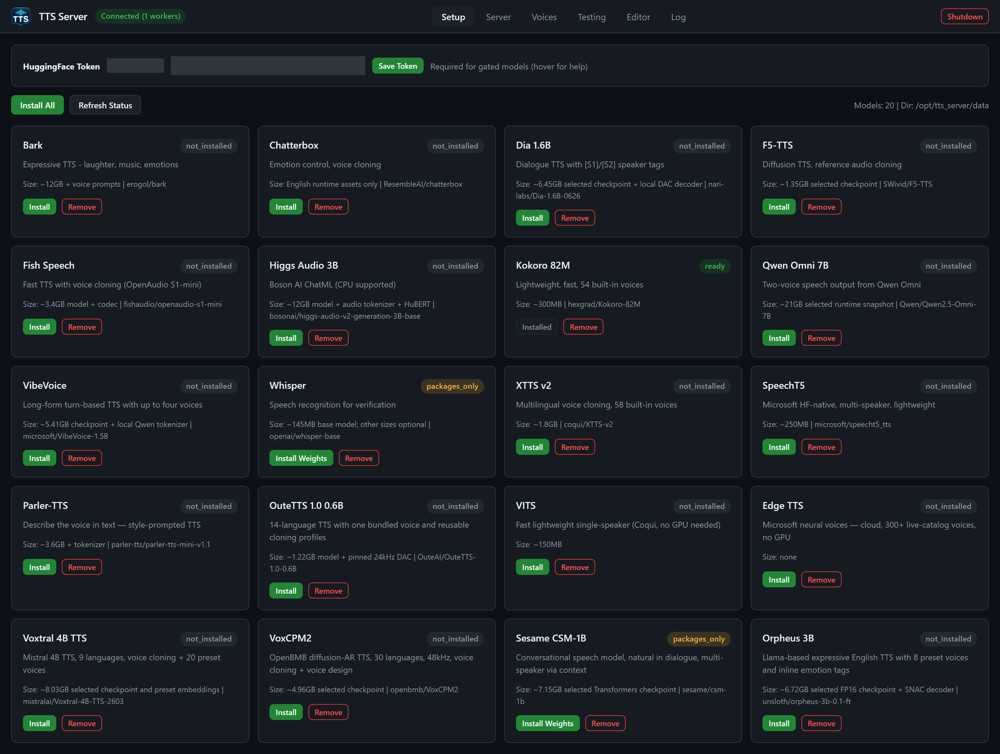
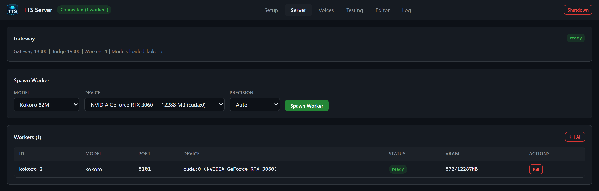

# Illustrated quickstart

Create your first narration, then save an edited version. These images come from the running TTS Server and an actual Kokoro generation on 25 September 2026. They show the same web interface used by the desktop app, without the Windows title bar.

## Before you begin

Extract the complete portable release to a writable local folder on Windows with WSL2 enabled. Paths such as `E:\tts_server` are examples. Run **Start-TTSServer.cmd** and wait for **Connected** in the header. A source checkout alone does not contain the distro image; see [identity and requirements](identity-and-requirements.md) and [start and stop](start-stop-and-portability.md).

## 1. Check Kokoro

Open **Setup** and find **Kokoro 82M**. In the complete portable release it is already **ready / Installed**, including the data needed for offline speech. If you are using a source build or previously removed it, click **Install** or **Install Weights**, follow progress in **Log**, and return when ready. Kokoro is a small local engine with built-in voices, so this example needs no uploaded reference voice.

Installing prepares packages and weights on disk. It does not load a worker. **Install Weights** means that packages exist but the required weights still need to be installed. VITS is the exception that can fetch weights on first load. A Hugging Face token is needed for gated downloads; its saved status and input are concealed in this screenshot. See [Setup](gui-setup.md) for the complete status table.

## 2. Load a worker

Open **Server**. Choose **Kokoro 82M**, a device available on your machine, and **Auto** precision. Click **Spawn Worker** and wait for the row's **ready** badge. First loading can take longer than subsequent requests.

The screenshot uses `cuda:0` on an RTX 3060; your GPU number and memory will differ. The green Connected header means the gateway is reachable. Check the worker's own status before generating. See [Server](gui-server.md).

## 3. Generate and listen

Open **Testing**, select your Kokoro worker and **af_heart** under Voice, then enter:

> Studio demo. Every voice begins with an idea. Turn a short script into clear, natural narration, then shape the sound in the editor. A gentle pause gives each sentence room to breathe. Listen to the take, refine the details, and save a finished version when it sounds right.

Keep WAV and the default post-processing settings. Leave Whisper verification off for this first example; it adds a speech-recognition model to the workflow. Click **Generate**, wait for **completed** in Response History, then click **Play**. **Save** downloads the generated take.

This session produced 18.6 seconds of audio in 2.1 seconds, with an already loaded and warmed worker. Those numbers are a session example, not a performance guarantee. Refreshing the page clears Response History; the saved job remains in Editor. See [Testing](gui-testing.md).

## 4. Open the take in Editor

Open **Editor**, enter `Studio demo` in the Library search, expand the completed job, and click its **FINAL** row. Wait for the waveform. **CHK 0** is the individual generated chunk; FINAL is the assembled output.

Drag across the waveform to select a region. The selection enables **Cut**, **Trim to Selection**, **Silence**, **Fade In**, and **Fade Out**. Selecting a range alone changes no audio. Add a range operation with one of those buttons, or use **+ Add Effect** for full-track processing.

The image shows High-pass, Compressor, and LUFS Normalize as an example chain. These effects process the whole track even while a region is selected. Listen and choose settings for your recording; the pictured values are not a preset for every voice. Before rendering, Play still plays the loaded source. See [Editor](gui-editor.md) and [audio editor usage](audio-editor-usage.md).

## 5. Save and download the edit

Click **Save As...**, enter a simple name such as `studio_demo_master`, choose **WAV**, and click **Save**. The dialog accepts a name and format; use CLI/API output-path options if you need an absolute destination.

Wait for the new **EDIT** row to appear. On successful completion it becomes the loaded source and the applied effects chain clears. Click **Play** to hear the rendered file, then **Download** to save it through the browser or desktop host. The original FINAL remains available.

Edits are stored under the job's `edits/` directory. Testing jobs are temporary library jobs subject to retention, so download work you want to keep or use a named project through the CLI/API. See [jobs and projects](jobs-and-projects.md).

## Other useful tabs

- **Voices** manages uploaded reference clips. It is separate from the engine's built-in Voice list. The [Voices page](gui-voices.md) shows a synthetic demo upload and explains transcripts.
- **Log** shows progress and errors. Read the last error if generation fails; a connected gateway alone does not mean the take succeeded. The [Log page](gui-log-and-shutdown.md) shows this demo's real pipeline messages.
- When finished, **Shutdown** stops the workers and server. See [start and stop](start-stop-and-portability.md) for normal shutdown and recovery.

For capture details and image regeneration, see the [image notes](images/README.md). Return to the [manual index](README.md) for the complete guide.
